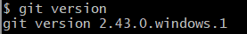
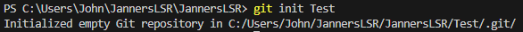
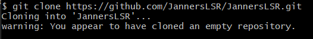
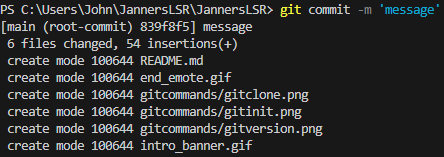
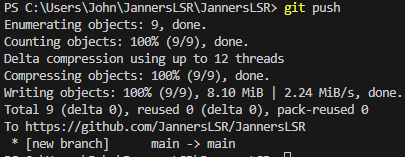

<!--
**JannersLSR/JannersLSR** is a ✨ _special_ ✨ repository because its `README.md` (this file) appears on your GitHub profile.

Here are some ideas to get you started:

- 🔭 I’m currently working on ...
- 🌱 I’m currently learning ...
- 👯 I’m looking to collaborate on ...
- 🤔 I’m looking for help with ...
- 💬 Ask me about ...
- 📫 How to reach me: ...
- 😄 Pronouns: ...
- ⚡ Fun fact: ...
-->

# Hello I'm John Santos ✨✨
### Also known as Jahn, Jawn, Jann, Janners... you get the idea. 
___
## About me:
- **Currently an InfoTech student in MCL :smile:.**
- **Somewhat literate enough to read code 😵‍💫.**
- **Huge KPOP stan :notes: (some of my most fav groups: )**
  - **TripleS (트리플에스)**
  - **Fromis_9 (프로미스나인)**
  - **Billlie (빌리)**
  - **Dreamcatcher (드림캐쳐)**
  - **Weeekly (위클리)**
- **I can read Korean**
___
## Git Commands Cheat Sheet:
#### Installing and Opening Git gives you access to Git Bash which is a shell application used to interface Git commands
- **`$ git version`**
  **Verifies that Git was installed in the system. Shows the Git Version.**
  **Example:**
  
- **`$ git init [folder name]`**
  **Initializes a new repository.**
  **Example:**
  
- **`$ git clone [existing repository]`**
  **Creates a copy of a repository.**
  **Example:**
  
- **`$ git commit -m [message]`**
  **Takes the staged snapshot and commits it to the project history.**
  **Example:**
  
- **`$ git push`**
  **Lets you move a local branch to another repository.**
  **Example:**
  
- **`$ git add [existing repository]`**
  Adds a repo
  **Example:**
- `$ git `
  loremipsum
  **Example:**
___
## Socials:
  

___
## Thanks for looking at my profile! :sparkling_heart:

